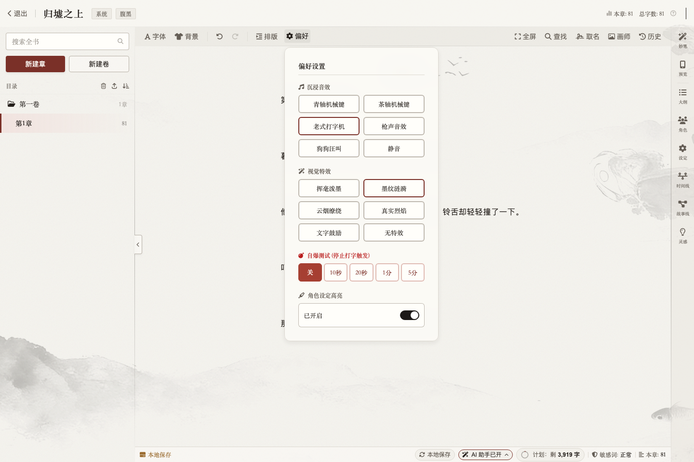

# 易创 EasyWriting - AI 网文创作助手

> 纯本地的网文写作软件：小说写作、码字统计、AI 辅助创作、排行榜风向。作品、设定和写作记录存在你自己的设备上；无需注册登录，基础写作功能可离线使用。

**iOS 版** · 基于 [easy-writing](https://github.com/yilujian/easy-writing) 二次开发

[English](./README.en.md) · [界面预览](#界面预览) · [功能](#功能) · [安装](#安装)

## 界面预览

**本地创作首页**

**写作台与体验设置**

**AI 工作流建书**

## 为什么选它

- **数据在你手里**：作品、设定、码字记录全部存本机，支持定时自动备份成 txt + json，随时整本导出。
- **AI 用你自己的钥匙（BYOK）**：可配置 DeepSeek、通义千问、智谱、Kimi、OpenAI 等模型，以及多数提供 OpenAI 兼容接口的服务。API Key 保存在本机，请求时从你的设备直连所配置的模型服务商。Ollama、LM Studio 等本地部署模型同样支持——API Key 留空即可。
- **提示词全开放**：所有 AI 提示词是本机的 md 文件，界面里可视化改，或者直接改文件，连每个场景的采样温度都能调。
- **免费且开源**：AGPL-3.0 协议，代码全公开。

## 功能

### 写作

- **写作台**：富文本编辑器（TipTap），卷/章目录树、拖拽排序、全书搜索、查找替换
  - 边写边存（160ms 本地落盘 + 关窗快照），异常退出重开即恢复
  - 每章自动保留历史版本，随时回看与恢复
  - 敏感词检测（本地词库可自定义）、打字音效、专注模式、自爆挑战
- **参考资料五件套**：大纲、角色（含关系图画布）、设定、时间线、故事线（思维导图画布）
- **书架**：多作品管理、分组、封面、TXT/JSON 导入导出、回收站
- **码字统计**：今日字数、趋势图、码字日历、连续天数、每日目标；手写与 AI 产出分开记账
- **灵感速记**：首页快记 + 素材库 + 写作台面板，一份数据三处可用

### 写作体验与个性化

- **沉浸式打字反馈**：支持青轴机械键、茶轴机械键、老式打字机、枪声、狗狗汪叫等按键音效，也可完全静音
- **光标处视觉特效**：每次输入可触发挥毫泼墨、墨纹涟漪、云烟缭绕、真实烈焰或文字鼓励，不喜欢动效可一键关闭
- **编辑器自由排版**：可调整字体、粗细、颜色、字号、行高、正文宽度、段间空行、对齐方式与网格线样式
- **四套主题与背景**：内置无界通透、古韵信笺、森系护眼、暗夜水墨四套主题，附带 8 张背景图，也可使用自己的图片作为写作背景
- **专注与阅读预览**：支持全屏写作、停止输入倒计时的"自爆挑战"，以及与正文同步滚动的手机阅读预览

### AI 辅助（需自备 API Key）

- **划词 AI 工具**：选中文字一键润色 / 扩写 / 纠错 / 自定义指令，改完可采纳可废弃
- **续写补全**：快捷键整拍续写（流式进正文）+ 打字时的幽灵字建议（Tab 采纳）
- **妙笔对话**：右栏 AI 顾问，剧情 / 人设 / 设定随时聊，会话历史本地保存
- **工作流一键建书**：灵感 → 大纲 → 设定 → 建书 → 逐章自动生文，断点可续
- **竞品拆书**：TXT 整本导入，逐章拆解节奏与卖点，黄金三章深析 + 全书报告
- **取名器 / 简介生成 / AI 封面**：人名地名功法批量起，简介按平台风格生成
- **AI 调用账本**：每次调用的场景、字数、Token、成败原因全记录

### 榜单风向

内置各站排行榜（起点 / 番茄 / 七猫等 80+ 源），趋势分析、标签风向、CSV 导出、AI 解读。

## iOS 版说明

- 基于 Tauri + Vue3 桌面版移植
- 使用 WKWebView 包装，注入 Tauri API Mock 层
- 数据存储使用 localStorage / IndexedDB
- 最低支持 iOS 16.0
- 桌面端的 SQLite 数据库在 iOS 版中由 localStorage 替代

## 安装

### iOS
- 下载 Release 中的 `.ipa` 文件
- 使用 TrollStore / AltStore / Sideloadly 等工具安装
- 最低系统要求：iOS 16.0

### 桌面版
请访问 [原仓库 Releases](https://github.com/yilujian/easy-writing/releases) 下载 macOS / Windows 版本。

## 仓库说明

- **私有仓库**（本仓库）：完整源码 + iOS 安装包 + 文档
- **公共构建仓库**：MusicBuilder（CI 构建用，Release 含 IPA）

## 版本

- 当前 iOS 版：v1.0.0
- 基于原仓库版本：v1.0.5

## 许可证

AGPL-3.0-only
